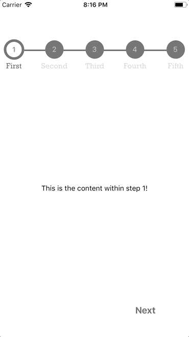

[](http://makeapullrequest.com)

# react-native-progress-steps

A simple and fully customizable React Native component that implements a progress stepper UI. 
* Each steps content is displayed inside of a customizable ScrollView. 
* Fully customizable buttons are displayed at the bottom of the component to move between steps.


Example One             |  Example Two
:-------------------------:|:-------------------------:
 [examples/ExampleOne.js](examples/ExampleOne.js)|  [examples/ExampleTwo.js](examples/ExampleTwo.js)


## Installation

If using yarn:

```
yarn add react-native-progress-steps
```

If using npm:

```
npm i react-native-progress-steps
```

## Usage

```
import { ProgressSteps, ProgressStep } from 'react-native-progress-steps';
```

Simply place a `<ProgressStep />` tag for each desired step within the `<ProgressSteps />` wrapper.

```
<View style={{flex: 1}}>
    <ProgressSteps>
        <ProgressStep label="First Step">
            <View style={{ alignItems: 'center' }}>
                <Text>This is the content within step 1!</Text>
            </View>
        </ProgressStep>
        <ProgressStep label="Second Step">
            <View style={{ alignItems: 'center' }}>
                <Text>This is the content within step 2!</Text>
            </View>
        </ProgressStep>
        <ProgressStep label="Third Step">
            <View style={{ alignItems: 'center' }}>
                <Text>This is the content within step 3!</Text>
            </View>
        </ProgressStep>
    </ProgressSteps>
</View>
```

### Button Styling Usage
Button container and text are fully customizable using the `nextBtnStyle, nextBtnTextStyle, previousBtnStyle, and previousBtnTextStyle` props.

Example usage to change a buttons text color: 

```
const buttonTextStyle = {
    color: '#393939'
};

return (
    <View style={{flex: 1}}>
        <ProgressSteps>
            <ProgressStep label="First Step" nextBtnTextStyle={buttonTextStyle} previousBtnTextStyle={buttonTextStyle}>
                <View style={{ alignItems: 'center' }}>
                    <Text>This is the content within step 1!</Text>
                </View>
            </ProgressStep>
            <ProgressStep label="Second Step" nextBtnTextStyle={buttonTextStyle} previousBtnTextStyle={buttonTextStyle}>
                <View style={{ alignItems: 'center' }}>
                    <Text>This is the content within step 2!</Text>
                </View>
            </ProgressStep>
        </ProgressSteps>
    </View>
)
```

### Current Step Error and Validation Handling
The `errors` prop should be used if there's a need for validation and error handling when clicking the next button. If you would like to prevent the next step from being rendered, set the `errors` prop to `true`. By default, it will be `false`.

Example usage of validation check:

```
state = {
    isValid: false,
    errors: false
};

onNextStep = () => {
    if (!this.state.isValid) {
      this.setState({ errors: true });
    } else {
      this.setState({ errors: false });
    }
};

render() {
    return (
      <View style={{ flex: 1 }}>
        <ProgressSteps>
          <ProgressStep label="First Step" onNext={this.onNextStep} errors={this.state.errors}>
            <View style={{ alignItems: 'center' }}>
              <Text>This is the content within step 1!</Text>
            </View>
          </ProgressStep>
          <ProgressStep label="Second Step">
            <View style={{ alignItems: 'center' }}>
              <Text>This is the content within step 2!</Text>
            </View>
          </ProgressStep>
        </ProgressSteps>
      </View>
    );
}

```

## Documentation

### Progress Steps Component
| Name                      | Description                              | Default     | Type    |
|---------------------------|------------------------------------------|-------------|---------|
| borderWidth               | Width of the progress bar between steps  | 6           | Number  |
| borderStyle               | Type of border for the progress bar      | solid       | String  |
| activeStepIconBorderColor | Outside border color for the active step | #4bb543     | String  |
| progressBarColor          | Color of the default progress bar        | #ebebe4     | String  |
| completedProgressBarColor | Color of the completed progress bar      | #4bb543     | String  |
| activeStepIconColor       | Color of the active step icon            | transparent | String  |
| completedStepIconColor    | Color of the completed step icon         | #4bb543     | String  |
| disabledStepIconColor     | Color of the disabled step icon          | #ebebe4     | String  |
| labelFontFamily           | Font family for the step icon label      | iOS/Android default font | String |
| labelColor                | Color of the default label               | lightgray   | String  |
| labelFontSize             | Font size for the step icon label        | 14          | Number  |
| activeLabelColor          | Color of the active label                | #4bb543     | String  |
| activeLabelFontSize       | Optional font size for the active step icon label      | null     | Number  |
| completedLabelColor       | Color of the completed label             | lightgray   | String  |
| activeStepNumColor        | Color of the active step number          | black       | String  |
| completedStepNumColor     | Color of the completed step number       | black       | String  |
| disabledStepNumColor      | Color of the disabled step number        | white       | String  |
| completedCheckColor       | Color of the completed step checkmark    | white       | String  |
| activeStep                | Manually specify the active step         | 0           | Number  |
| isComplete                | Set all Steps to active state            | false       | Boolean |
| topOffset                 | Set progress bar top offset              | 30          | Number  |
| marginBottom              | Set progress bar bottom margin           | 50          | Number  |

### Progress Step Component
| Name | Description | Default | Type |
|------------------|--------------------------------------------------------------------------|----------|---------|
| label | Title of the current step to be displayed | null | String |
| onNext | Function called when the next step button is pressed | null | Func |
| onPrevious | Function called when the previous step button is pressed | null | Func |
| onSubmit | Function called when the submit step button is pressed | null | Func |
| nextBtnText | Text to display inside the next button | Next | String |
| previousBtnText | Text to display inside the previous button | Previous | String |
| finishBtnText | Text to display inside the button on the last step | Submit | String |
| nextBtnStyle | Style object to provide to the next/finish buttons | { textAlign: 'center', padding: 8 } | Object |
| nextBtnTextStyle | Style object to provide to the next/finish button text | { color: '#007aff', fontSize: 18 } | Object |
| nextBtnDisabled | Value to disable/enable next button | false | Boolean |
| previousBtnStyle | Style object to provide to the previous button | { textAlign: 'center', padding: 8 } | Object |
| previousBtnTextStyle | Style object to provide to the previous button text | { color: '#007aff', fontSize: 18 } | Object |
| previousBtnDisabled | Value to disable/enable previous button | false | Boolean |
| scrollViewProps | Object to provide props to ScrollView component | {} | Object |
| scrollable | The content of the Progress Step should be scrollable | true | Boolean |
| viewProps | Object to provide props to view component if scrollable is false | {} | Object |
| errors | Used to assist with current step validation. If true, the next step won't be rendered | false | Boolean |
| removeBtnRow | Used to render the progress step without the button row | false | Boolean |

## Contributing
Pull requests are always welcome! Feel free to open a new GitHub issue for any changes that can be made.

**Working on your first Pull Request?** You can learn how from this *free* series [How to Contribute to an Open Source Project on GitHub](https://egghead.io/series/how-to-contribute-to-an-open-source-project-on-github)

## Author
Colby Miller | [https://colbymillerdev.com](https://colbymillerdev.com)

## License
[MIT](./LICENSE)
