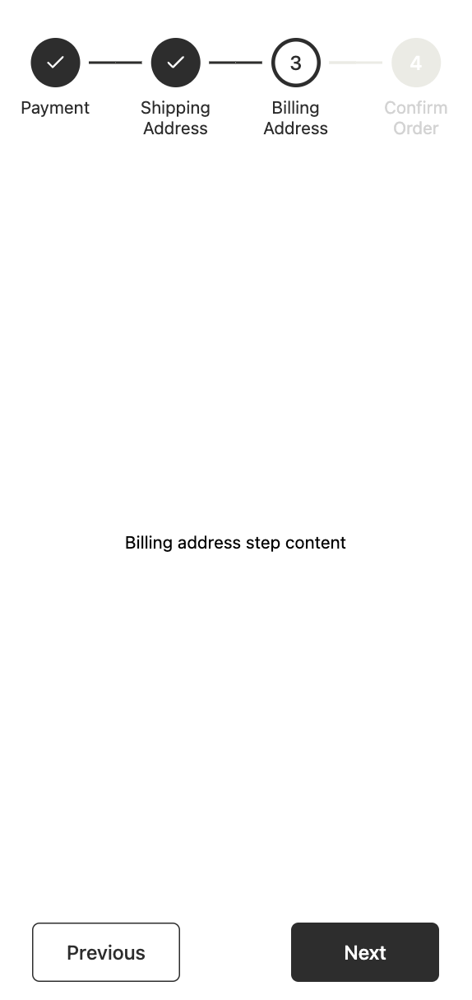

[](http://makeapullrequest.com)

# React Native Progress Steps

A simple and fully customizable React Native component that implements a progress stepper UI.

- Each steps content is displayed inside of a customizable ScrollView.
- Customizable buttons are displayed at the bottom of the component to move between steps.

## ✨ What's New in v2.0

- 🎯 **Full TypeScript Support** - Complete type definitions for an enhanced development experience
- 🔄 **Modern Component Architecture** - Refactored to use functional components and React hooks
- 🎨 **Major UI/UX Improvements**
  - Enhanced responsiveness and layout
  - Modernized styling with new step icons, default colors, and button design
  - Improved performance
  - Better readability
- 💫 **Smooth Step Transitions** - Added subtle animations when changing between steps
- 🛠️ **Enhanced Customization** - Streamlined props with new customization options and removal of legacy features
- ⛔️ **Breaking Changes** - Some props have been removed and renamed. See the [Migration Guide](#migration-guide-v1-to-v2) for more details.

## Example



<a href="examples/example.jsx">examples/example.jsx</a>

## Installation

```
npm i react-native-progress-steps
```

## Usage

```
import { ProgressSteps, ProgressStep } from 'react-native-progress-steps';
```

Simply place a `<ProgressStep />` tag for each desired step within the `<ProgressSteps />` wrapper.

```
<View style={{flex: 1}}>
    <ProgressSteps>
        <ProgressStep label="First Step">
            <View style={{ alignItems: 'center' }}>
                <Text>This is the content within step 1!</Text>
            </View>
        </ProgressStep>
        <ProgressStep label="Second Step">
            <View style={{ alignItems: 'center' }}>
                <Text>This is the content within step 2!</Text>
            </View>
        </ProgressStep>
        <ProgressStep label="Third Step">
            <View style={{ alignItems: 'center' }}>
                <Text>This is the content within step 3!</Text>
            </View>
        </ProgressStep>
    </ProgressSteps>
</View>
```

### Button Styling Usage

Navigation buttons are customizable using the various props provided to the `ProgressStep` component. See the [Progress Step Component](#progress-step-component) section for more details.

Simple example to set a specific button text:

```
return (
    <View style={{flex: 1}}>
        <ProgressSteps>
            <ProgressStep label="First Step" buttonNextText="Next Step" buttonPreviousText="Previous Step">
                <View style={{ alignItems: 'center' }}>
                    <Text>This is the content within step 1!</Text>
                </View>
            </ProgressStep>
            <ProgressStep label="Second Step" buttonNextText="Next Step" buttonPreviousText="Previous Step">
                <View style={{ alignItems: 'center' }}>
                    <Text>This is the content within step 2!</Text>
                </View>
            </ProgressStep>
        </ProgressSteps>
    </View>
)
```

### Hiding the Button Row

To hide the button row, set the `removeBtnRow` prop to `true`. The current step can be changed without the buttons by updating and managing the `activeStep` prop on the `<ProgressSteps />` component.

```
const [activeStep, setActiveStep] = useState(0);

<ProgressSteps activeStep={activeStep}>
    <ProgressStep label="First Step" removeBtnRow>
        <View style={{ alignItems: 'center' }}>
            <Text>This is the content within step 1!</Text>
        </View>
    </ProgressStep>
</ProgressSteps>
```

### Current Step Error and Validation Handling

The `errors` prop should be used if there's a need for validation and error handling when clicking the next button. If you would like to prevent the next step from being rendered, set the `errors` prop to `true`. By default, it will be `false`.

Example usage of validation check:

```
const [isValid, setIsValid] = useState(false);
const [errors, setErrors] = useState(false);

const onNextStep = () => {
    if (!isValid) {
      setErrors(true);
    } else {
      setErrors(false);
    }
};

return (
    <View style={{ flex: 1 }}>
        <ProgressSteps>
          <ProgressStep label="First Step" onNext={onNextStep} errors={errors}>
            <View style={{ alignItems: 'center' }}>
              <Text>This is the content within step 1!</Text>
            </View>
          </ProgressStep>
          <ProgressStep label="Second Step">
            <View style={{ alignItems: 'center' }}>
              <Text>This is the content within step 2!</Text>
            </View>
          </ProgressStep>
        </ProgressSteps>
      </View>
);
```

## Documentation

### Progress Steps Component

| Name                      | Description                                       | Default        | Type    |
| ------------------------- | ------------------------------------------------- | -------------- | ------- |
| borderWidth               | Width of the progress bar between steps           | 2              | Number  |
| activeStepIconBorderColor | Outside border color for the active step          | #2D2D2D        | String  |
| progressBarColor          | Color of the default progress bar                 | #EBEBE4        | String  |
| completedProgressBarColor | Color of the completed progress bar               | #2D2D2D        | String  |
| activeStepIconColor       | Color of the active step icon                     | transparent    | String  |
| completedStepIconColor    | Color of the completed step icon                  | #2D2D2D        | String  |
| disabledStepIconColor     | Color of the disabled step icon                   | #EBEBE4        | String  |
| labelFontFamily           | Font family for the step icon label               | System default | String  |
| labelColor                | Color of the default label                        | #D3D3D3        | String  |
| labelFontSize             | Font size for the step icon label                 | 14             | Number  |
| activeLabelColor          | Color of the active label                         | #2D2D2D        | String  |
| activeLabelFontSize       | Optional font size for the active step icon label | 14             | Number  |
| completedLabelColor       | Color of the completed label                      | #2D2D2D        | String  |
| activeStepNumColor        | Color of the active step number                   | #2D2D2D        | String  |
| completedStepNumColor     | Color of the completed step number                | #2D2D2D        | String  |
| disabledStepNumColor      | Color of the disabled step number                 | #FFFFFF        | String  |
| completedCheckColor       | Color of the completed step checkmark             | #FFFFFF        | String  |
| activeStep                | Manually specify the active step                  | 0              | Number  |
| isComplete                | Set all Steps to active state                     | false          | Boolean |
| topOffset                 | Set progress bar top offset                       | 60             | Number  |
| marginBottom              | Set progress bar bottom margin                    | 30             | Number  |

### Progress Step Component

| Name                    | Description                                                                           | Default   | Type    |
| ----------------------- | ------------------------------------------------------------------------------------- | --------- | ------- |
| label                   | Title of the current step to be displayed                                             | undefined | String  |
| onNext                  | Function called when the next step button is pressed                                  | undefined | Func    |
| onPrevious              | Function called when the previous step button is pressed                              | undefined | Func    |
| onSubmit                | Function called when the submit step button is pressed                                | undefined | Func    |
| scrollViewProps         | Object to provide props to ScrollView component                                       | undefined | Object  |
| scrollable              | The content of the Progress Step should be scrollable                                 | true      | Boolean |
| viewProps               | Object to provide props to view component if scrollable is false                      | undefined | Object  |
| errors                  | Used to assist with current step validation. If true, the next step won't be rendered | false     | Boolean |
| removeBtnRow            | Used to render the progress step without the button row                               | false     | Boolean |
| buttonNextText          | Text to display inside the next button                                                | Next      | String  |
| buttonPreviousText      | Text to display inside the previous button                                            | Previous  | String  |
| buttonFinishText        | Text to display inside the button on the last step                                    | Submit    | String  |
| buttonNextDisabled      | Value to disable/enable next button                                                   | false     | Boolean |
| buttonPreviousDisabled  | Value to disable/enable previous button                                               | false     | Boolean |
| buttonFinishDisabled    | Value to disable/enable finish button                                                 | false     | Boolean |
| buttonTopOffset         | Set button row top offset                                                             | 12        | Number  |
| buttonBottomOffset      | Set button row bottom offset                                                          | 20        | Number  |
| buttonHorizontalOffset  | Set button row horizontal offset                                                      | 30        | Number  |
| buttonFillColor         | Background color for the next/finish buttons                                          | #2D2D2D   | String  |
| buttonBorderColor       | Border color for the previous button                                                  | #2D2D2D   | String  |
| buttonNextTextColor     | Text color for the next button                                                        | #FFFFFF   | String  |
| buttonPreviousTextColor | Text color for the previous button                                                    | #2D2D2D   | String  |
| buttonFinishTextColor   | Text color for the finish button                                                      | #FFFFFF   | String  |
| buttonDisabledColor     | Background color for disabled buttons                                                 | #CDCDCD   | String  |
| buttonDisabledTextColor | Text color for disabled buttons                                                       | #FFFFFF   | String  |

## Migration Guide (v1 to v2)

### Breaking Changes

#### Renamed Props

The following props have been renamed for better clarity and consistency:

| Old Prop Name       | New Prop Name          | Component    |
| ------------------- | ---------------------- | ------------ |
| nextBtnText         | buttonNextText         | ProgressStep |
| previousBtnText     | buttonPreviousText     | ProgressStep |
| finishBtnText       | buttonFinishText       | ProgressStep |
| nextBtnDisabled     | buttonNextDisabled     | ProgressStep |
| previousBtnDisabled | buttonPreviousDisabled | ProgressStep |

#### Removed Props

The following props have been removed in favor of the new styling system:

| Removed Prop         | Alternative                                            |
| -------------------- | ------------------------------------------------------ |
| nextBtnStyle         | Use `buttonFillColor` and other button styling props   |
| nextBtnTextStyle     | Use `buttonNextTextColor` instead                      |
| previousBtnStyle     | Use `buttonBorderColor` and other button styling props |
| previousBtnTextStyle | Use `buttonPreviousTextColor` instead                  |
| finishBtnStyle       | Use `buttonFillColor` and other button styling props   |
| finishBtnTextStyle   | Use `buttonFinishTextColor` instead                    |
| borderStyle          | No longer supported                                    |

#### New Button Styling System

Instead of using style objects, the new version provides specific props for common button customizations:

```
// Old way
<ProgressStep
  nextBtnStyle={{ backgroundColor: '#2D2D2D' }}
  nextBtnTextStyle={{ color: '#FFFFFF' }}
>
  {/* content */}
</ProgressStep>

// New way
<ProgressStep
  buttonFillColor="#2D2D2D"
  buttonNextTextColor="#FFFFFF"
>
  {/* content */}
</ProgressStep>
```

See the [Progress Step Component](#progress-step-component) section for all available button styling props.

## Contributing

Pull requests are always welcome! Feel free to open a new GitHub issue for any changes that can be made.

**Working on your first Pull Request?** You can learn how from GitHub's [First Contributions](https://github.com/firstcontributions/first-contributions) guide or their [How to Contribute to Open Source](https://opensource.guide/how-to-contribute/) guide.

## Author

Colby Miller | [https://colbymillerdev.com](https://colbymillerdev.com)

## License

[MIT](./LICENSE)
